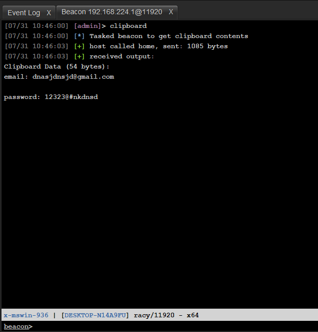

# GetClipboard

* GetClipboard-BOF comes from the reverse pseudocode restoration of clipboard.x64.o after CS4.7 decryption

* Cobalt Strike Reflective DLL Get clipboard content. The code basically comes from [ReflectiveDLLInjection](https://github.com/stephenfewer/ReflectiveDLLInjection)

## Example
- RDl
  
  

- BOF
  
  
